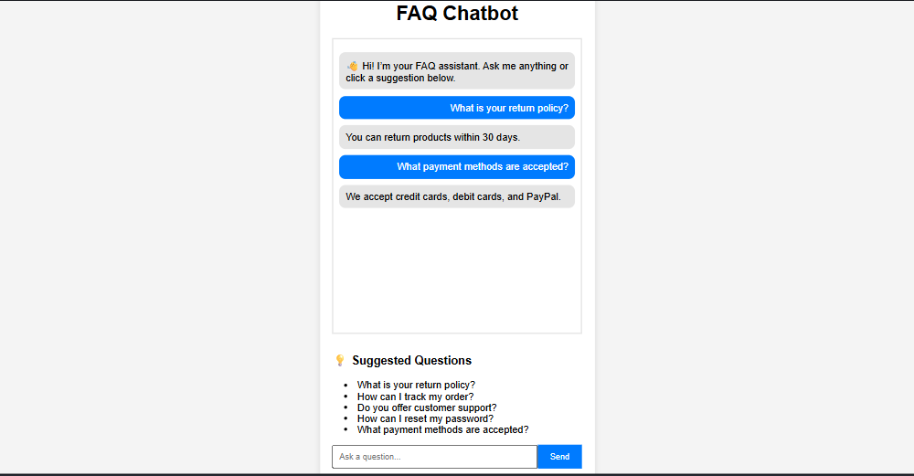

# 🤖 FAQ Chatbot Web App

A simple AI-powered FAQ chatbot built using Flask, NLP (NLTK), and TF-IDF cosine similarity.  
The chatbot matches user questions with the most relevant FAQ and returns the best answer.

---

## 🚀 Features

- 💬 Chatbot interface for asking questions
- 🧠 NLP-based preprocessing (tokenization, stopword removal)
- 📊 TF-IDF + Cosine Similarity matching
- 💡 Suggested questions for user guidance
- 👋 Welcome message on startup
- 🌐 Simple and clean web UI
- ⚡ Fast Flask backend

---

## 🛠️ Tech Stack

- Python
- Flask
- NLTK
- Scikit-learn
- HTML, CSS, JavaScript
- Waitress (for production server)

---

## 📂 Project Structure

```
FAQ-Chatbot/
│
├── app.py
├── faq_data.py
├── requirements.txt
│
├── templates/
│   └── index.html
│
└── static/
    └── style.css
```

---

## ⚙️ Installation & Setup

### 1️⃣ Clone the repository

```bash
git clone https://github.com/mailmekratika-sketch/CodeAlpha.git
cd CodeAlpha_Chatbot-for-FAQ
```

---

### 2️⃣ Create virtual environment (optional)

```bash
python -m venv venv
venv\Scripts\activate   # Windows
```

---

### 3️⃣ Install dependencies

```bash
pip install -r requirements.txt
```

---

### 4️⃣ Run the application

```bash
python app.py
```

---

## 🌐 Open in Browser

Visit:

```
http://127.0.0.1:5000
```

---

## 💬 How it works

1. User enters a question
2. Text is cleaned and preprocessed using NLTK
3. TF-IDF converts text into vectors
4. Cosine similarity finds the closest FAQ match
5. Best answer is returned as chatbot response

---

## 💡 Example Questions

- What is your return policy?
- How can I track my order?
- How do I reset my password?
- What payment methods are accepted?
- Do you offer customer support?

---

## 📸 UI Features

- Chat-style interface
- Suggested clickable questions
- Bot welcome message
- Auto-scrolling chat window

---
## App Screenshot

- 

## 🔮 Future Improvements

- 🔥 AI-powered semantic search (BERT / Sentence Transformers)
- 📱 Mobile responsive UI
- 🧾 Admin panel to add FAQs dynamically
- 💾 Chat history storage (database)
- 🎤 Voice input chatbot

---

## 👨‍💻 Author

Developed as a learning project for NLP + Flask practice.

---

## 📄 License

This project is open-source and free to use for educational purposes.
