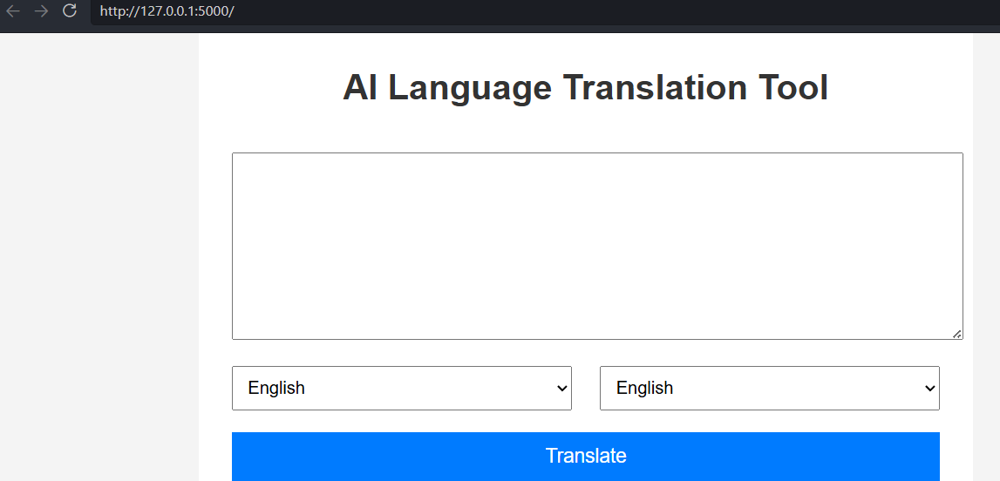

# 🌐 Language Translation Tool

A simple Flask-based web application that translates text from one language to another using Google Translator.

## 🚀 Features

- Translate text between multiple languages
- User-friendly web interface
- Supports:
  - English
  - French
  - Spanish
  - German
  - Hindi
  - Tamil
  - Telugu
- Built with Flask and Python
- Responsive UI with CSS

---

## 🛠️ Technologies Used

- Python
- Flask
- deep-translator
- HTML
- CSS
- Waitress

---

## 📂 Project Structure

```bash
CodeAlpha_Language-Translation-Tool/
│
├── app.py
├── requirements.txt
│
├── templates/
│   └── index.html
│
└── static/
    └── style.css
```

---

## ⚙️ Installation

### 1️⃣ Clone the repository

```bash
git clone <your-repository-url>
```

### 2️⃣ Navigate to the project folder

```bash
cd CodeAlpha_Language-Translation-Tool
```

### 3️⃣ Install dependencies

```bash
pip install -r requirements.txt
```

### 4️⃣ Run the application

```bash
python app.py
```

---

## 🌍 Open in Browser

Visit:

```bash
http://127.0.0.1:5000
```

---

## 📸 Screenshot




## 📌 Future Improvements

- Add speech-to-text support
- Add dark mode
- Support more languages
- Add translation history
- Deploy online using Render/Heroku

---

## 👨‍💻 Author

Developed by Kratika Bhadoria

---

## 📄 License

This project is for educational purposes.